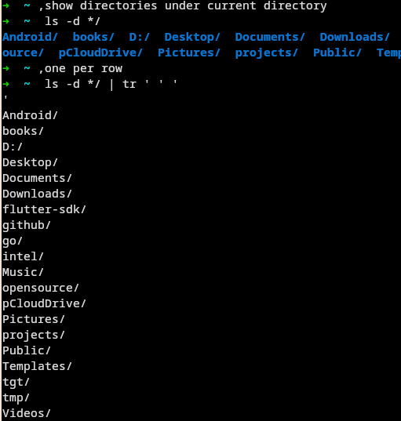

## Install

1. Clone to plugins directory of oh-my-zsh
```zsh
cd $ZSH/custom/plugins 
git clone git@github.com:JunYang-tes/oh-my-zsh-gpt.git
```

2. Enable this plugin by editing `~/.zshrc`
```diff
- plugins=(git)
+ plugins=(git oh-my-zsh-gpt)
```

## Show case

